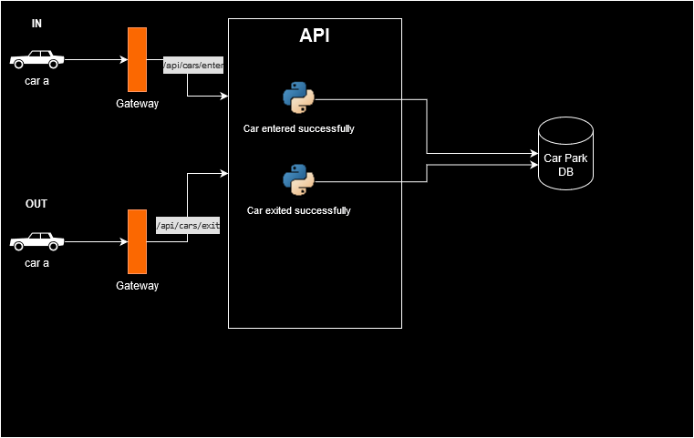

# Car Park API Documentation

This document describes the API for a simple car park management system built using FastAPI.



## Prerequisites
- FastAPI
- Uvicorn

## Functionality

This API allows you to:

- Add cars to the car park (up to the capacity limit).
- Remove cars from the car park.
- Get the current status of the car park (number of cars parked and available spaces).
- View the queue of cars waiting to enter the car park (when full).

## Models

The API uses two models:

- Car: Represents a car with a unique identifier (car_id).
- CarPark: Represents the car park with its capacity, available spaces, occupied spaces, and a queue for waiting cars.

## Endpoints
### Entering a car

    URL: /api/cars/enter
    Method: POST
    Request body: JSON object containing a car_id field.
    Response:
        Success (200): JSON object with success set to True and a message indicating success.
        Failure (409): JSON object with success set to False and a message indicating the car park is full and the car has been added to the queue.
        Other failures (e.g., invalid data): JSON object with appropriate error details.

### Exiting a car

    URL: /api/cars/exit
    Method: POST
    Request body: JSON object containing a car_id field.
    Response:
        Success (200): JSON object with success set to True and a message indicating success.
        Failure (404): JSON object with success set to False and a message indicating the car was not found in the car park.
        Other failures (e.g., invalid data): JSON object with appropriate error details.

### Getting car park status

    URL: /api/cars/count
    Method: GET
    Response: JSON object with:
        total_cars: Number of cars currently parked.
        available_spaces: Number of available spaces remaining.

### Getting car queue

    URL: /api/cars/queue
    Method: GET
    Response: JSON object with:
        queue: An array containing the car_ids of cars waiting in the queue (empty if no queue).

### Example usage
```bash
# Entering a car:

curl -X POST http://localhost:8000/api/cars/enter -H "Content-Type: application/json" -d '{"car_id": "ABC123"}'

# Exiting a car:

curl -X POST http://localhost:8000/api/cars/exit -H "Content-Type: application/json" -d '{"car_id": "ABC123"}'

# Getting car park status:

curl http://localhost:8000/api/cars/count

# Getting car queue:

curl http://localhost:8000/api/cars/queue
```

This documentation provides a basic overview of the API. For further details or specific error codes, please refer to the source code.